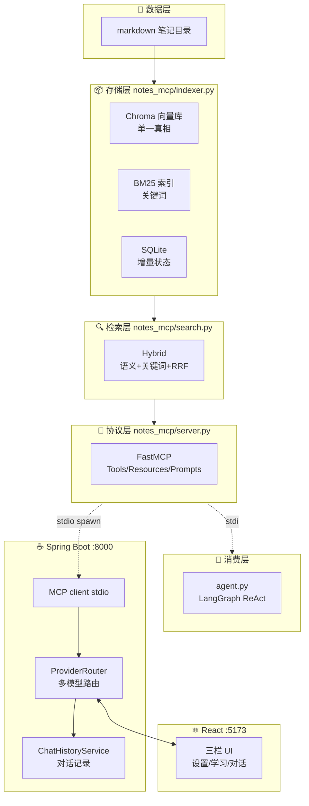
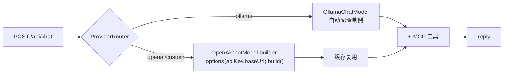

# notes-mcp 实现解析（怎么做的 + 为什么这么做）

> 给自己看的——逐模块讲**怎么实现**和**为什么选这个方案**（含备选对比）。
> 读完后应能扛住面试官每一个"为什么"。配套 [踩坑记录](../05-记录/踩坑记录.md)（坑的细节）+ [设计文档](../02-设计/设计文档_2026-07-17_v0.1.md)（原始设计）。
> 2026-07-20

---

## 0. 全局视角：先记住一张图



**一句话记忆**：找（Tools）→ 拿（Resources）→ 用（Prompts）。笔记库是一个标准 MCP server，工具供给与 AI 工具解耦。

---

## 1. 协议层 · `notes_mcp/server.py`（FastMCP）

### 怎么实现

用工厂 `create_mcp(searcher, config)` 闭包捕获已建库的 searcher，注册三大原语：

- **Tools**（🤖 模型控制）：`search_notes` / `get_note` / `list_topics`——LLM 自己决定调哪个
- **Resources**（📦 应用控制）：`notes://stats`、`notes://note/{title}`（模板 URI）
- **Prompts**（👤 用户控制）：`explain` / `review` / `quiz` / `compare`——用户选"拿笔记干嘛"

建库时机用 FastMCP 的 `lifespan`：server 启动时一次性建库，yield 出 searcher 给闭包用。

### 为什么这么选

| 决策 | 选 | 备选 | 理由 |
|---|---|---|---|
| MCP 框架 | **FastMCP** | 官方 `mcp` SDK 内置 fastmcp | 文档完善，lifespan/resource 模板/prompt 全都好用 |
| 三大原语全做 | ✅ | 只做 Tools | Prompts 才是"记笔记有什么用"的答案，是项目差异化核心 |
| 传输优先级 | **stdio 优先** | streamable-http | 跨实现互操作最稳（HTTP 踩过大坑，见 #16） |

> ⚠️ 场景追问：为什么 stdio 比 http 稳？——stdio 是同一进程管道，无网络层；streamable-http 涉及 Spring AI Java ↔ fastmcp Python 跨实现的会话管理，互操作坑多。

---

## 2. 检索层 · `notes_mcp/search.py`（Hybrid + RRF）

### 怎么实现

两路并行检索，各返回 `chunk_id` 排序列表，RRF 融合：

```
query → [语义路: Chroma.query(embed(query), k)]
       [关键词路: BM25.retrieve(jieba(query), k) → 经 id_map 映射成 chunk_id]
            ↓ RRF 融合
       取 top_k → 从 Chroma 拼文本+metadata → 带溯源 Hit
```

**RRF 公式**：`RRF(d) = Σ 1/(k + rank_r(d))`，k=60。

### 为什么这么选

| 决策 | 选 | 备选 | 理由 |
|---|---|---|---|
| 检索策略 | **Hybrid 两路** | 纯语义 / 纯关键词 | 语义懂同义（"RAG"≈"检索增强"），关键词懂专有名词/代码；两者互补，实测都比单路准 |
| 融合方法 | **RRF** | 分数加权/归一化 | RRF **只需 rank 不需分数**，对两路不同量纲鲁棒，零调参 |
| RRF k 值 | **60** | 1 / 30 / 100 | 业界经验默认，平衡头部与尾部权重 |
| BM25 粒度 | **chunk 级** | 文件级 | **id 对齐命门**——两路必须用同一个 chunk_id 才能融合；文件级无法和语义路对齐 |

> ⚠️ 场景追问：为什么必须用 chunk_id 对齐？——语义路返回 chunk_id，BM25 返回 corpus 行号。如果 BM25 按文件建，行号和 chunk_id 对不上，RRF 就把不相干的结果"融合"了。所以 `id_map`（行号↔chunk_id）是融合正确性的命门。

---

## 3. 建库层 · `notes_mcp/indexer.py`（增量索引）

### 怎么实现

```
build():
  disk = _scan(notes_dirs)          # 扫磁盘 {path_str: mtime}
  db   = _load_db()                 # 读 SQLite {path_str: FileState{mtime,hash}}
  added/modified/deleted/touched/unchanged = _diff(disk, db)
  → 变化文件: 切块 + embed_batch + Chroma upsert
  → BM25 全量重建（bm25s 无增量 API）+ 持久化
  → SQLite 同步状态
```

**四态 diff**：
- `added`：磁盘有、库无 → 建库
- `modified`：mtime 变 **且** hash 变 → 删旧 chunk + 重建
- `touched`：mtime 变 **但** hash 没变 → **跳过**（省 embed 开销）
- `unchanged`：全没变 → 跳过

### 为什么这么选

| 决策 | 选 | 备选 | 理由 |
|---|---|---|---|
| 真相源 | **Chroma 单一真相** | 三库各自维护 | BM25/SQLite 都从 Chroma 派生，避免多源不一致 |
| key 类型 | **统一 `str(path.resolve())`** | Path/str 混用 | 致命 bug #8：`set[Path]-set[str]` 永不相等 → 增量全失效。SQLite 天然存 str |
| touched 跳过 | ✅ | 一律重 embed | embed 贵，touch（如 git checkout）只改 mtime 不改内容，hash 校验省掉无谓嵌入 |
| BM25 全量重建 | ✅ | 增量 | bm25s 无增量 API；每次有变就全量重建（从 Chroma 所有 doc），持久化到磁盘加速启动 |
| embed 失败 | **整体崩溃** | 静默跳过 | embed 失败=ollama 挂了，继续也是残库，不如直接让 server 起不来（显式失败优于隐性错误） |
| 单文件失败 | **skip + 记 errors** | 整体崩 | 单篇坏文件不该搞垮全库 |

> ⚠️ 场景追问：为什么 BM25 不能增量？——BM25 的 IDF 统计依赖全 corpus，加一篇文件会改变所有词的 IDF，所以理论上必须重算。这是 BM25 算法本质，不是库的限制。

---

## 4. 切块与嵌入 · `notes_mcp/chunker.py` + `embedder.py`

### 怎么实现

**切块**（chunker，纯逻辑无 I/O）：
- 滑动窗口 `chunk_size=300`，`overlap=50`（step=250）
- 标题：优先 Markdown H1（`# Title`），其次文件名
- chunk_id：`{source}#{chunk_index}` 全局唯一

**嵌入**（embedder）：
- `OllamaEmbedder` 用 `openai` SDK 走 ollama 的 `/v1/embeddings` 端点
- `embed_batch(texts, batch_size=128)`：一次 HTTP 塞多个文本

### 为什么这么选

| 决策 | 选 | 备选 | 理由 |
|---|---|---|---|
| 切块策略 | **滑动窗口** | 按标题/段落切 | 实现简单、可控；标题切法对格式不规范的笔记容易漏 |
| chunk_size=300 | ✅ | 更大/更小 | 检索要"小而精"定位，生成要"大而全"上下文——300 是经验平衡（rerank/chunk expansion 是未来优化） |
| overlap=50 | ✅ | 0 | 防止关键句被切断在边界，保留上下文连续性 |
| 嵌入模型 | **bge-m3** | text-embedding-3 / m3e | 多语言强（中英混合笔记）、1024 维、本地免费 |
| 走 openai SDK | ✅ | ollama 原生 SDK | ollama 兼容 OpenAI `/v1`，复用成熟 SDK，且未来可无缝切云端 |
| 批量嵌入 | **embed_batch** | 逐条 embed | **5 分钟 → 61 秒**（#13）。逐条 HTTP 往返是性能杀手，摊薄往返是首选优化 |

> ⚠️ 场景追问：为什么 chunk_size 是检索-生成的矛盾点？——检索时希望块小（精确定位到那段话），生成时希望块大（给 LLM 完整上下文）。纯滑动窗口是折中，生产级做法是 chunk expansion（检索小块、生成时扩回原文）。

---

## 5. 消费层 · `agent.py`（LangGraph ReAct）

### 怎么实现

```
config → LLM(ChatOpenAI 指向 ollama qwen3)
       → MultiServerMCPClient(连 notes-mcp + filesystem)
       → client.get_tools() 运行时动态发现工具
       → create_react_agent(llm, tools) → 命令行对话循环
```

### 为什么这么选

| 决策 | 选 | 备选 | 理由 |
|---|---|---|---|
| Agent 框架 | **LangGraph** | 手写 `while tool_calls` | 状态机图 + 回边（笔记 09-11 已学，复用理论） |
| MCP client | **langchain-mcp-adapters** | 手写 ClientSession | `MultiServerMCPClient.get_tools()` 返回 BaseTool 直 bind agent，多 server 动态汇总 |
| 多 server | notes-mcp + filesystem | 单 server | 演示"不改 ReAct 循环，只换工具来源"——MCP 核心卖点 |

> ⚠️ 场景追问：MCP 和 Function Calling 啥关系？——FC 是"模型会不会调工具"（模型能力），MCP 是"工具怎么标准化暴露/发现"（协议）。链路：MCP server 暴露 Tools → host 转成 FC schema → LLM 决策 → 回 MCP 执行。**FC 是手，MCP 是插座**。

---

## 6. Web 后端 · `web/backend/`（Spring Boot）

### 6.1 整体职责

把 MCP 能力包成 REST API 给前端用，承担三件事：多 Provider 路由、对话记录持久化、MCP client 转发。

### 6.2 ProviderRouter · 多 Provider 动态路由（核心）



| 决策 | 选 | 理由 |
|---|---|---|
| 支持多 Provider | Ollama + OpenAI + 自定义 | 本地免费 + 云端强大，一键切换 |
| Ollama | 自动配置单例 | 本地固定端点，单例够用 |
| OpenAI/自定义 | **动态创建** OpenAiChatModel | 见下坑 |
| 第三方也挂 MCP 工具 | ✅ | 让 DeepSeek 也能检索笔记，不只是聊天 |

> ⚠️ **核心坑 #18**：`ChatClient.options().apiKey()` **不会**覆盖自动配置 OpenAiChatModel 的内部 client 凭据（默认 `unused`）。必须 `OpenAiChatModel.builder().options(opts).build()` 动态创建，让 Spring AI 从 options 读 apiKey/baseUrl 构建新 client。ProviderRouter 加缓存（同配置复用），避免每次请求重建。

### 6.3 ChatHistoryService · 对话持久化

- SQLite 两表：`sessions(id,title,created_at,updated_at)` + `messages(id,session_id,role,content,created_at)`
- 标题自动取首条用户消息前 30 字
- `POST /api/chat` 自动创建/复用 session，存 user + assistant 两条消息

### 6.4 MCP client · stdio spawn（三个坑 #16）

Spring AI spawn Python 子进程连 MCP，三个关键点：

| 坑 | 解法 |
|---|---|
| 子进程 cwd 没生效 → `No module named notes_mcp` | `pip install -e .` 装进 venv + `PYTHONPATH` 环境变量 |
| 相对路径 `./data/chroma` 落到别处 → 全量重建超时 | Config `_resolve_path` 基于项目根解析（不依赖 cwd） |
| stdout 缓冲 → Java 读不到响应超时 | `-u` 无缓冲 + `PYTHONUNBUFFERED=1` 双保险 |

### 6.5 main() 启动前注入 NOTES_DIR

`NotesMcpBackendApplication.main()` 在 Spring 启动前读 `settings.json` 的 `notesDir`，设为系统属性 `NOTES_DIR`，application.yml 用 `${NOTES_DIR:默认}` 传给 Python 子进程。这样改笔记目录只需改 settings.json（重启生效）。

---

## 7. Web 前端 · `web/frontend/`（React）

### 怎么实现

| 部分 | 技术 |
|---|---|
| 脚手架 | Vite + TypeScript |
| UI 库 | antd（ConfigProvider 配紫色主题 + 中文 locale） |
| 路由 | react-router-dom（/ /note/:title /dashboard /learn） |
| Markdown | react-markdown + remark-gfm |
| 状态 | 各组件 useState（无 Redux/Zustand） |

**三栏布局**：Sidebar（文件树 + 会话列表）+ ChatArea（对话+快捷指令+输入）+ InfoPanel（知识状态）。

**Settings Drawer**：三 Tab（笔记目录/Provider/模型），设置变更通过 `refreshKey` 通知 Header 重新加载，保持全局同步。

### 为什么这么选

| 决策 | 选 | 备选 | 理由 |
|---|---|---|---|
| UI 库 | **antd** | MUI / 手写 | 中文生态好、组件全（Drawer/Tabs/Tree 齐备）、配置即主题 |
| 状态管理 | **useState + refreshKey** | Redux/Zustand | 个人工具状态简单，全局状态就 Provider/模型，用 key 触发刷新够用，避免过度工程 |
| 文件树 | 后端 `GET /api/notes/tree` 返回结构 | 前端扁平分组 | 真实多层嵌套，VS Code 式体验 |
| Vite 代理 | `/api` → 8000 | 直连后端 | 避免 CORS（虽然后端也配了 CORS，代理更省心） |

---

## 8. 工程地基

| 工具 | 作用 | 为什么选 |
|---|---|---|
| **ruff** | lint + format 二合一 | 取代 black+flake8+isort 三个工具，极快 |
| **mypy** | 渐进式类型检查 | 非 strict，入门友好；`ignore_missing_imports` 放行无 stub 的库 |
| **pytest** | 测试 | 96 tests，asyncio_mode=auto 免装饰器 |
| **pre-commit** | 提交即体检 | ruff/mypy/标准 hooks 自动跑 |
| **check-sync** | 防文档漂移 | 校验 requirements.txt ↔ 配置.md，治 #1 漂移复发 |
| **FakeEmbedder** | 测试用假嵌入器 | 返回 shake_128 确定性向量，不依赖 ollama，单测秒级 |

**测试金字塔**：单元（rrf_fuse/chunker/indexer 纯逻辑，ms 级）→ 集成（FastMCP in-memory Client + fake embedder）→ e2e（真实 ollama + stdio，标 `@integration`）。

**为什么依赖注入是命门**：Indexer/Searcher 构造器收 `embedder/collection/bm25`，测试注入 FakeEmbedder，不碰 ollama。业务层纯逻辑（不 import fastmcp），可直接单测。

---

## 9. 一页纸速查 · 所有设计决策

| 领域 | 决策 | 一句话理由 |
|---|---|---|
| MCP 框架 | FastMCP | 文档全、原语齐 |
| 传输 | stdio 优先 | 跨实现最稳 |
| 向量库 | Chroma | 持久化+metadata+易用 |
| 关键词 | bm25s | 快 100x |
| 中文分词 | jieba | 事实标准 |
| 嵌入 | bge-m3 | 多语言、本地免费 |
| 检索 | Hybrid + RRF | 互补、零调参融合 |
| 建库 | 增量四态 | 省 embed |
| key | 统一 str | 避类型混用 bug |
| Agent | LangGraph | 状态机复用理论 |
| 后端 | Spring Boot + Spring AI | 主流 + Java MCP client |
| 多 Provider | ProviderRouter 动态创建 | 解 apiKey 覆盖坑 |
| 对话记录 | SQLite | 轻量、零运维 |
| 前端 | React + antd + Vite | 中文生态、组件全 |
| Lint | ruff | 二合一极速 |
| 防漂移 | check-sync | 单一信息源 |

---

## 10. 面试自测 · 场景追问

读完试着自己答（答不上来就回去看对应章节）：

1. **为什么用 Hybrid 而不是纯语义？** → 语义懂同义、关键词懂专有名词，互补
2. **RRF 为什么不用分数加权？** → 只需 rank，对不同量纲鲁棒，零调参
3. **两路检索怎么对齐？** → chunk_id；BM25 chunk 级建，id_map 行号↔chunk_id
4. **增量建库怎么省 embed？** → touched（mtime 变 hash 没变）跳过
5. **embed 失败为什么直接崩？** → ollama 挂了继续是残库，显式失败优于隐性错误
6. **BM25 为什么必须全量重建？** → IDF 依赖全 corpus，加一篇全变
7. **stdio 连 MCP 三个坑是什么？** → cwd/import、相对路径、stdout 缓冲
8. **第三方 Provider 为什么不能复用自动配置的 OpenAiChatModel？** → apiKey 不覆盖内部 client 凭据，必须动态创建
9. **MCP 和 Function Calling 啥关系？** → FC 是手，MCP 是插座
10. **chunk_size 为什么是检索-生成的矛盾点？** → 检索要小、生成要大，折中 300

---

*本文档随项目演进持续更新。新增模块时，按"怎么实现 → 为什么这么选 → 踩坑链接"三段式补录。*
