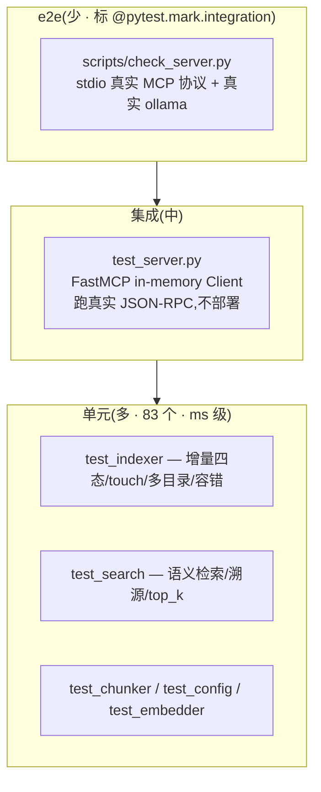

# notes-mcp 测试报告

> 版本 v1 · 2026-07-25 · 配套 [开发规范](../03-实现/开发规范.md) · [踩坑记录](../05-记录/踩坑记录.md) · [检索eval报告](./检索eval_2026-07-26.md)

---

## TL;DR

- **83 个测试全绿**,总覆盖率 **91%**(494 语句 / 43 未覆盖)
- 四层质量门:**ruff**(lint+format) + **mypy**(类型) + **pytest**(单元/集成) + **check-sync**(防漂移)
- 检索质量量化:35 条 eval query,纯语义 **recall@5=97.1% / MRR=0.718**
- **23 条踩坑记录**(现象/根因/修复/启示),面试金矿
- 单元测试用 `FakeEmbedder`(shake_128 确定性向量),**不依赖 ollama**,毫秒级

---

## 1. 测试概览

| 指标 | 值 |
|---|---|
| 测试数 | 83 |
| 通过率 | 100% |
| 总覆盖率 | 91%(494 语句 / 43 未覆盖) |
| 运行时长 | ~13s(纯测试)/ ~21s(含覆盖率) |
| 测试依赖 | pytest + pytest-asyncio + pytest-cov + FakeEmbedder |

---

## 2. 覆盖率明细

| 模块 | 语句 | 未覆盖 | 覆盖率 | 未覆盖行 |
|---|---|---|---|---|
| `__init__.py` | 1 | 0 | **100%** | — |
| `chunker.py` | 36 | 1 | 97% | 104 |
| `config.py` | 69 | 2 | 97% | 176-177 |
| `indexer.py` | 144 | 5 | 97% | 226, 244, 249, 306-307 |
| `embedder.py` | 25 | 1 | 96% | 68 |
| `search.py` | 39 | 2 | 95% | 58, 81 |
| `server.py` | 89 | 12 | 87% | 42, 81-82, 91-92, 117, 157-158, 163, 168-170 |
| `cli.py` | 87 | 16 | 82% | 44-46, 54-63, 121, 140-142, 183 |
| `__main__.py` | 4 | 4 | 0% | 3-8 |
| **TOTAL** | **494** | **43** | **91%** | — |

### 未覆盖分析(均属合理留白)

- **`__main__.py` 0%**:模块入口(`python -m notes_mcp`),4 行难单测,由 e2e(`check_server.py`)覆盖
- **`cli.py` 82%**:serve 流程(`mcp.run` 阻塞)、index/query 命令——CLI 入口属集成范畴
- **`server.py` 87%**:部分 prompt(explain/review/quiz/compare 分支)、`_read_note_by_title` 的 H1 匹配、`_all_sources`
- **`search.py` 95%** / **`indexer.py` 97%**:极端异常分支(空库、cid 不在 map、OSError)

**核心业务逻辑(indexer/search/chunker/config)覆盖率 95%+**,入口/集成层留白合理。

---

## 3. 测试分层(金字塔)



| 层 | 数量 | 跑什么 | 速度 |
|---|---|---|---|
| **单元** | 多 | 纯逻辑 + FakeEmbedder 注入,不依赖 ollama | ms 级 |
| **集成** | 中 | FastMCP in-memory Client,真实 MCP 协议 | 秒级 |
| **e2e** | 少 | stdio 真实子进程 + 真实 ollama,标 `integration` | 慢(CI 可跳) |

---

## 4. 检索 Eval(质量量化)

> 单元测试只验证「不崩」,eval 验证「检索真的准」——这是普通项目少有、但秋招极值钱的一环。

| 指标 | 值 | 说明 |
|---|---|---|
| 数据集 | 35 条 query | `eval/queries.jsonl`(概念 + 精确关键词/代码/文件名) |
| 命中判定 | source 含 relevant 片段 | 文件级,宽松 |
| recall@5 | **97.1%** | top-5 内能否找到相关笔记 |
| MRR | **0.718** | 首个相关文档的倒数排名(排序质量) |
| recall@1 | 54.3% | 头部精确度(改进方向:rerank) |

**关键决策记录**:eval 曾证明 BM25 独占命中=0 且拖累 MRR(踩坑 #22/#23),已删除 BM25 纯语义化,零损失。

详见 [`检索eval_2026-07-26.md`](./检索eval_2026-07-26.md)。重跑:`venv/Scripts/python.exe scripts/eval_retrieval.py`

---

## 5. 静态质量门(四层)

| 门 | 工具 | 守护什么 | 命令 |
|---|---|---|---|
| **lint+format** | ruff | 代码风格/导入排序/常见 bug | `dev.py lint` / `format` |
| **类型** | mypy | 渐进式类型检查(非 strict) | `dev.py type` |
| **测试** | pytest | 83 单元+集成测试 | `dev.py test` |
| **防漂移** | check-sync | requirements ↔ 配置.md 单一信息源 | `dev.py check-sync` |
| **提交钩子** | pre-commit | commit 时自动跑上面全部 | `dev.py install-hooks`(一次) |

**当前状态**:ruff ✅ / mypy ✅(9 文件无 issue) / pytest ✅(83) / check-sync ✅

---

## 6. 运行方式

```bash
# 激活 venv 后
python scripts/dev.py test          # 跑全部测试(快)
python scripts/dev.py coverage      # pytest + 覆盖率报告
python scripts/dev.py lint          # ruff 静态检查
python scripts/dev.py format        # ruff 格式化(自动改)
python scripts/dev.py type          # mypy 类型检查
python scripts/dev.py check-sync    # 校验依赖/配置齐全(防漂移)
python scripts/eval_retrieval.py    # 检索 eval(需 ollama)
```

**HTML 覆盖率报告**:跑 coverage 后看 `htmlcov/index.html`(逐行覆盖,绿色=已覆盖、红色=未覆盖)。`htmlcov/` 已 gitignore,不入库。

---

## 7. 已知未覆盖 + 改进方向

| 项 | 现状 | 改进 |
|---|---|---|
| CLI 入口(serve/index/query) | 单测不覆盖 | 补 e2e:起 stdio server 跑 query |
| server prompts(explain/review...) | 部分分支未覆盖 | 补集成测试调 prompt 验返回结构 |
| `_read_note_by_title` H1 匹配 | 分支未覆盖 | 加测试:按 H1 标题取笔记 |
| e2e 自动化 | `check_server.py` 手动 | 接 CI(GitHub Actions) |

---

## 关联文档

- [开发规范](../03-实现/开发规范.md) — 测试规范 §5(金字塔/命名/FakeEmbedder)
- [踩坑记录](../05-记录/踩坑记录.md) — 23 条非平凡问题
- [检索eval报告](./检索eval_2026-07-26.md) — 检索质量量化
- [配置.md](../03-实现/配置.md) — 技术栈/依赖/运行步骤
