# notes-mcp 前端设计参考资料

> 给设计前端的 AI 用——系统架构、现有 API、产品定位、技术约束一次说清。
> 2026-07-20 · 阶段 3b 启动前

---

## 1. 产品一句话

把 markdown 笔记目录变成一个 **AI 知识助手**——用户用自然语言提问，系统从笔记中搜索相关内容，由大模型结合检索结果生成带出处的回答。

---

## 2. 系统架构（三层）

```mermaid
flowchart LR
    subgraph Frontend["🖥️ React 前端 (localhost:5173)"]
        UI[聊天界面<br/>待设计]
    end

    subgraph Backend["☕ Spring Boot 后端 (port 8000)"]
        CC[ChatClient]
        TC[ToolCallingAdvisor<br/>ReAct 工具调用循环]
        QW[qwen3:8b<br/>大模型生成]
    end

    subgraph MCPServer["🐍 notes-mcp server (Python/FastMCP)"]
        TOOLS[Tools<br/>search_notes / get_note / list_topics]
        PROMPTS[Prompts<br/>explain / review / quiz / compare]
        RES[Resources<br/>notes://stats / notes://note]
    end

    subgraph Storage["📦 存储层"]
        CH[Chroma<br/>语义向量]
        BM[BM25<br/>关键词索引]
        SQL[SQLite<br/>增量状态]
    end

    subgraph Data["📂 数据源"]
        MD[markdown 笔记<br/>d:/Learn/AI/笔记/]
    end

    Frontend -->|"POST /api/chat<br/>HTTP/JSON"| Backend
    Backend -->|"MCP stdio<br/>子进程 spawn"| MCPServer
    MCPServer --> Storage
    Storage --> Data
```



**数据流一句话**: 用户提问 → 前端 POST → Spring Boot 调 notes-mcp 检索笔记 → qwen3:8b 综合回答 → 返回前端。

**关键**: 后端不是普通 API，而是「智能体」——它自动决定查什么、怎么查、怎么综合，前端不需要知道检索细节。前端只需要发消息、收回答。

---

## 3. 现有后端 API

### 唯一的端点：`POST /api/chat`

```
请求:  { "message": "什么是 RAG？" }
响应:  { "reply":   "RAG 是检索增强生成…（基于笔记综合回答）" }
```

| 属性 | 值 |
|---|---|
| 方法 | `POST` |
| Content-Type | `application/json` |
| 服务地址 | `http://localhost:8000` |
| CORS | 已允许 `http://localhost:5173` |
| 鉴权 | 无（本地个人使用） |
| 流式 | **无**（目前是同步返回完整文本，非打字机效果） |
| 会话 | **无状态**（每次请求独立，不带对话历史） |

### 答案示例

用户问 "什么是 MCP"，后端返回类似：

```json
{
  "reply": "MCP 即 Model Context Protocol，是 Anthropic 于 2024 年 11 月开放的…\n\n### 来源\n- `12-MCP协议精读.md` 第 3 段\n- `Agent核心概念.md` 第 7 段"
}
```

> 返回的 `reply` 是纯文本（目前无 Markdown 渲染要求，但如果前端支持 Markdown 渲染会更好，因为回答里经常有 `###` 标题、列表、加粗等）。

---

## 4. 后端能调用的笔记能力（notes-mcp 提供的工具）

这些是后端通过 MCP 协议**已经能调用**的能力。目前都封装在 `/api/chat` 里（模型自动决策），但如果前端需要**直接访问**（跳过 LLM），随时可以暴露为独立 REST 端点：

| 能力 | 说明 | 输入 | 输出 |
|---|---|---|---|
| `search_notes` | 混合检索（语义+关键词融合） | 自然语言查询 | 笔记片段 + 来源文件 + 标题 |
| `get_note` | 按标题取完整笔记原文 | 笔记标题 | 整篇 markdown |
| `list_topics` | 列出知识库所有笔记标题 | 无 | 标题列表 |
| `stats` | 知识库统计 | 无 | JSON: 笔记数、chunk 数、嵌入模型 |
| `explain` | 用笔记讲解某概念 | 概念名 | 讲解文本 |
| `review` | 生成复习提纲 + 自测题 | 主题 | 提纲 + 题目 |
| `quiz` | 出题测掌握度 | 主题 | 混合题型 |
| `compare` | 对比两个概念（表格） | A, B | 对比表 |

> 🔑 **对前端设计的关键启示**: 目前只有 `/api/chat` 一个「智能体对话」模式。如果 UI 需要侧边栏显示话题列表、直接搜笔记、查看统计等功能，告诉我——底层能力已就绪，在后端加 REST 端点就是几行代码的事。

---

## 5. 技术约束

| 项 | 值 | 说明 |
|---|---|---|
| 前端框架 | React (Vite + TypeScript) | 已决定，UI 库待选（antd 备选） |
| 前端端口 | `5173` | Vite 默认 |
| 后端端口 | `8000` | Spring Boot |
| API 前缀 | `/api/*` | CORS 只对这个前缀放行 |
| CORS 方法 | `GET, POST, OPTIONS` | 前端可调用这些方法 |
| 响应模式 | 同步（无 SSE） | 目前返回完整文本，非逐字流式 |
| 会话状态 | 无（每次独立请求） | 多轮对话的前端需自行管理消息列表 |
| 鉴权 | 无 | 本地单用户，不需登录 |

---

## 6. 前端页面建议

### 6.1 最小可行版（MVP）

| 区域 | 功能 | 说明 |
|---|---|---|
| **对话区**（主） | 消息列表 + 输入框 | 核心交互：发消息、看回答。消息支持 Markdown 渲染 |
| **快捷指令** | 预设按钮 | "讲解概念" "复习主题" "对比概念" "出题自测"，点击填入模板文案 |
| **空状态** | 首次进入提示 | 示例问题、知识库统计（"你的知识库有 24 篇笔记 1052 个片段，可以问我任何问题"） |

### 6.2 增强版

| 区域 | 功能 | 对应新增 API |
|---|---|---|
| **侧边栏** | 话题列表（可点击的笔记目录树） | `GET /api/topics` |
| **来源引用** | 回答中的 `来源: xxx.md` 可点击，弹出笔记原文 | `GET /api/notes/{title}` |
| **知识库状态** | 侧边栏底部：笔记数、最后更新时间 | `GET /api/stats` |
| **会话历史** | 侧边栏：历史对话列表 | 需要后端加会话存储（目前没有） |

---

## 7. 给设计 AI 的核心交代

1. **这是个人学习助手，不是通用聊天机器人**——回答基于用户笔记库，不是互联网。设计上应体现"我的知识库"的感觉。
2. **主界面是一个对话页**——类似 ChatGPT/Claude 的聊天界面，但消息有「来源引用」。
3. **建议有侧边栏**——让用户看到"库里有什么"，不瞎问。侧边栏可以列出笔记标题树。
4. **支持 Markdown 渲染**——回复里经常有标题、列表、代码块、加粗。
5. **快捷指令按钮**——帮你、复习、出题、对比，这是项目的核心差异化功能（不是只聊天，而是把笔记「用起来」）。
6. **后端只有一个 `/api/chat`**，API 不够时随时加即可，别让 API 限制了 UI 设计。

---

## 8. 设计输出格式建议

把 UI 设计交给我实现时，建议提供以下任一格式：

- **截图/Figma 链接** — 最直观
- **HTML/CSS 静态稿** — 我可以直接转 React 组件
- **文字描述** — 告诉我页面布局、有什么区域、每个区域干什么、交互逻辑

并说明：
- 哪些区域用哪个 API（如果设计中有我还没提供的 API，标出来我补）
- 颜色/字体/间距偏好（有 Figma 最好，没有就用 antd 默认主题）

---

## 9. 附录：接口请求/响应示例

### POST /api/chat

**请求**:
```json
{
  "message": "解释一下 Transformer 的自注意力机制"
}
```

**响应**:
```json
{
  "reply": "自注意力（Self-Attention）是 Transformer 的核心机制…\n\n### 关键点\n1. 每个词都会和序列中所有词计算注意力权重\n2. 公式: Attention(Q,K,V) = softmax(QK^T/√dk)V\n3. 相比 RNN，自注意力可以并行计算，且能捕捉长距离依赖\n\n*来源: d:/Learn/AI/笔记/基础学习/05-Transformer精读.md*"
}
```

### 后端代码 (ChatController.java) — 供理解用

```java
@RestController
@RequestMapping("/api")
public class ChatController {
    private final ChatClient chatClient;           // Spring AI 对话客户端 (qwen3:8b)
    private final ToolCallbackProvider tools;      // notes-mcp 工具自动注册

    @PostMapping("/chat")
    public ChatResponse chat(@RequestBody ChatRequest request) {
        String reply = chatClient.prompt()
                .user(request.message())            // 用户消息
                .tools(tools)                       // 挂上笔记检索工具
                .call()                             // 触发 LLM + 工具调用循环
                .content();                         // 取最终文本
        return new ChatResponse(reply);
    }
}
// ChatRequest: record(String message)
// ChatResponse: record(String reply)
```
