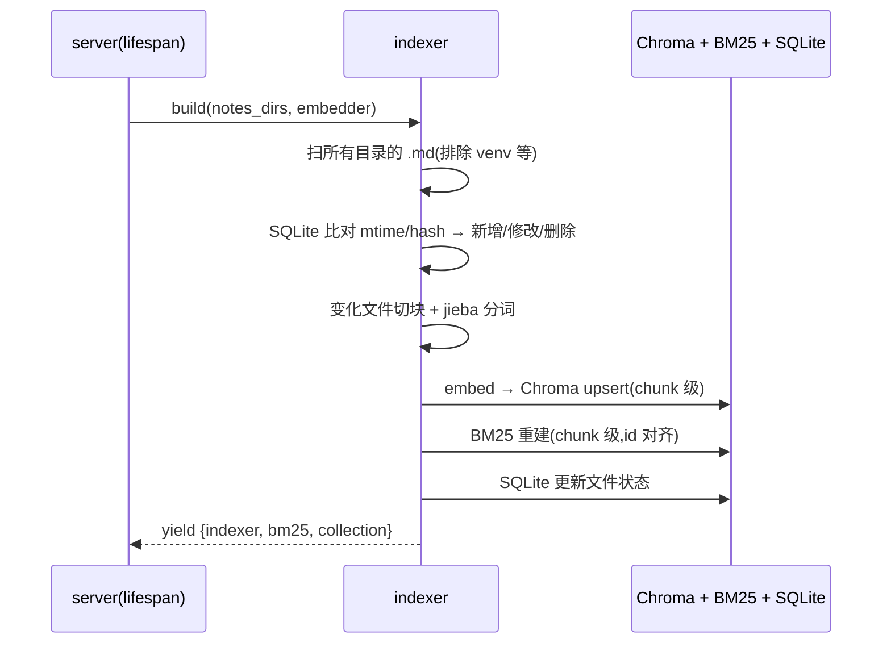
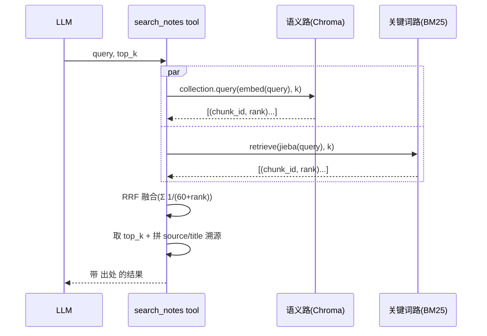

# notes-mcp 设计文档

> 版本 v0.1 · 2026-07-17 · 项目实战 P3
> 配套:[README](../README.md) · [需求分析](./需求分析.md)

---

## 1. 系统架构

### 1.1 分层

```
┌─────────────────────────────────────────────┐
│ 协议层  MCP(JSON-RPC 2.0)· stdio / HTTP   │  FastMCP
├─────────────────────────────────────────────┤
│ 原语层  Tools(找)· Resources(拿)· Prompts(用)│  找→拿→用,Prompts 是应用层核心
├─────────────────────────────────────────────┤
│ 检索层  hybrid:语义(Chroma)+ BM25 + RRF  │  search.py
├─────────────────────────────────────────────┤
│ 存储层  Chroma 向量库 · BM25 索引 · SQLite  │  indexer.py
├─────────────────────────────────────────────┤
│ 数据层  markdown 笔记目录(一个或多个)      │
└─────────────────────────────────────────────┘
        +
┌─────────────────────────────────────────────┐
│ 消费侧  LangGraph ReAct agent(async)        │  agent.py
│         MultiServerMCPClient(自己+fs+fetch) │
└─────────────────────────────────────────────┘
```

### 1.2 整体拓扑

```
生产侧 notes-mcp server                    消费侧 agent / 外部 client
┌──────────────────────────────┐         ┌──────────────────────────┐
│ FastMCP("notes-mcp")          │         │ Claude Desktop / Cursor  │
│  lifespan:启动建库            │◄─stdio──│ MCP inspector            │
│  Tools/Resources/Prompts      │  或 HTTP│ 自写 LangGraph agent      │
│  双传输: stdio / HTTP         │ ───────►│  (多 server 动态发现)    │
└──────────────────────────────┘         └──────────────────────────┘
```

---

## 2. 模块划分

| 模块 | 职责 | 关键依赖 |
|---|---|---|
| `notes_mcp/config.py` | 读 `.env`,校验配置,解析多目录 | python-dotenv |
| `notes_mcp/embedder.py` | `OllamaEmbedder`:bge-m3 嵌入,`.embed()/.dim/.name` | openai |
| `notes_mcp/indexer.py` | 扫多目录 + 切块 + Chroma + BM25 + SQLite 增量 + 溯源 metadata | chromadb, bm25s, jieba |
| `notes_mcp/search.py` | hybrid 检索:语义路 + BM25 路 + RRF 融合 | indexer 产物 |
| `notes_mcp/server.py` | FastMCP server:三大原语 + lifespan 建库 + 双传输 | fastmcp |
| `notes_mcp/cli.py` | CLI:`serve` / `index` / `query` | argparse |
| `agent.py` | 消费侧 LangGraph agent(MultiServerMCPClient) | langchain-mcp-adapters, langgraph |

---

## 3. 核心数据流

### 3.1 建库流程(server lifespan 触发,一次性)



### 3.2 检索流程(`search_notes`)



### 3.3 MCP 调用流程(client → server)

```
client(claude/agent) ── initialize(协议版本+能力) ──► server
                    ◄── capabilities ──
                    ── tools/list · resources/list · prompts/list ──►
                    ── tools/call(search_notes,...) / resources/read(notes://stats) ──►
                    ◄── 结果 ──
```

---

## 4. 数据模型

### 4.1 Chroma collection

- **collection 名**:`notes_{embed_model}_{dim}`(如 `notes_bge-m3_1024`),维度随模型,避免混用。
- **每个 chunk** 一条记录:

| 字段 | 说明 |
|---|---|
| `id` | `{source}#{chunk_index}` 全局唯一 |
| `document` | chunk 文本 |
| `embedding` | bge-m3 1024 维向量 |
| `metadata.source` | 源文件绝对路径 |
| `metadata.title` | 笔记标题(markdown H1 / 文件名) |
| `metadata.chunk_index` | 该文件内 chunk 序号 |
| `metadata.mtime` | 源文件修改时间 |
| `metadata.root` | 所属 `NOTES_DIR` 根(多目录溯源) |

### 4.2 SQLite 状态表(`files`)

| 列 | 类型 | 说明 |
|---|---|---|
| `path` | TEXT PK | 文件绝对路径 |
| `mtime` | REAL | 修改时间戳 |
| `hash` | TEXT | 内容 md5 |
| `indexed` | INT | 是否已入索引 |

→ 增量:扫目录时比对,仅处理 新增 / 修改 / 删除 三类。

### 4.3 BM25 索引

- **chunk 级**(非文件级),id 与 Chroma 的 chunk id 对齐 → 保证 RRF 两路能融合。
- `bm25s.BM25(corpus=chunks).index(jieba 分词)`;查询 `retrieve(jieba(query), k)`。

---

## 5. 接口设计(MCP 三大原语)

> 控制权归属(呼应笔记⑳):Tools = 模型控制 / Resources = 应用控制 / Prompts = 用户控制。

### 5.1 Tools(model-controlled)

```python
@mcp.tool()
def search_notes(query: str, top_k: int = 5) -> str:
    """hybrid 检索学习笔记(语义+关键词融合),返回带出处。"""
    # 返回格式:每条 = 标题 + 片段 + 【来源:文件路径】

@mcp.tool()
def get_note(title: str) -> str:
    """按标题取整篇笔记。"""

@mcp.tool()                      # [P1]
def list_topics() -> str:
    """列出所有笔记标题(markdown H1)。"""
```

### 5.2 Resources(application-controlled)

```python
@mcp.resource("notes://stats")
def stats() -> str:
    """知识库统计:笔记数、chunk 数、embedding 模型、最近更新。"""
    # 返回 JSON

@mcp.resource("notes://index")   # [P1]
def index() -> str:
    """笔记目录树。"""

@mcp.resource("notes://note/{title}")
def note_by_title(title: str) -> str:
    """按标题取整篇(模板 URI)。"""
    # ⚠️ 路径安全:resolved.is_relative_to(root) 防遍历
```

### 5.3 Prompts(user-controlled)⭐ 应用层核心

> 「找出来有什么用」的答案:每个 Prompt = 检索相关笔记 + 按特定方式组织成**可用产物**(讲解 / 提纲 / 题 / 对比表)。控制权在用户(user-controlled)——用户主动选「我要拿笔记干嘛」。

```python
# —— P0 核心(找→拿→用 的「用」)——
@mcp.prompt()
def explain(concept: str) -> str:
    """用笔记把某概念讲清楚(检索 + 组织讲解 + 举例)。"""

@mcp.prompt()
def review(topic: str) -> str:
    """生成某主题复习提纲 + 关键点 + 自测题。"""

@mcp.prompt()
def quiz(topic: str) -> str:
    """基于笔记出题,检测掌握度(主动回忆)。"""

@mcp.prompt()
def compare(a: str, b: str) -> str:
    """对比两个概念(检索 + 制对比表)。"""

# —— P1 ——
@mcp.prompt()
def connect(topic: str) -> str:
    """找某主题跨笔记的关联(织知识网)。"""
def apply(problem: str) -> str:
    """用笔记知识分析/解决具体问题(迁移)。"""
def summarize(target: str) -> str:
    """浓缩某主题/某篇笔记(提炼)。"""
```

---

## 6. 关键算法:Hybrid + RRF

**两路检索**:
- 语义路:`collection.query(query_embeddings=[embed(query)], n_results=k)`
- 关键词路:`bm25.retrieve(bm25s.tokenize(jieba.cut(query)), k=k)`

**RRF 融合**(Reciprocal Rank Fusion,k=60):

$$\text{RRF}(d) = \sum_{r \in R} \frac{1}{k + \text{rank}_r(d)}$$

- 无需归一化分数尺度、无需调参,对两路不同量纲鲁棒。
- **id 对齐是命门**:两路都用 chunk_id(BM25 chunk 级建),否则融合对不上。
- 取 RRF 得分 top_k。

---

## 7. 技术选型

| 决策 | 选 | 备选 | 理由 |
|---|---|---|---|
| server 框架 | **FastMCP** | mcp SDK 内置 fastmcp | gofastmcp 文档完善、lifespan/resource 模板/prompt 全 |
| BM25 | **bm25s** | rank_bm25 | 快 100x、现代维护、依赖轻 |
| 中文分词 | **jieba** | — | Python 中文分词事实标准 |
| 向量库 | **Chroma** | FAISS / others | 持久化、metadata、易用、教学友好 |
| agent 框架 | **LangGraph** | 手写 while | 复用笔记 09–11 的状态机 + 回边 |
| MCP client | **langchain-mcp-adapters** | 手写 ClientSession | `MultiServerMCPClient` 高级、`get_tools()` 返回 BaseTool 直 bind |

---

## 8. 配置项(`.env`)

| 变量 | 默认 | 说明 |
|---|---|---|
| `NOTES_DIR` | (必填) | 笔记目录,**多个用 `;` 分隔** |
| `OLLAMA_BASE_URL` | `http://127.0.0.1:11434/v1` | ollama 端点(不用 localhost 避 IPv6) |
| `OLLAMA_MODEL` | `qwen3:8b` | 生成模型(消费侧 agent 用) |
| `OLLAMA_API_KEY` | `ollama` | 占位 |
| `EMBED_MODEL` | `bge-m3` | 嵌入模型(1024 维) |
| `TOP_K` | `5` | 检索召回数 |
| `CHUNK_SIZE` | `300` | 切块字符数 |
| `OVERLAP` | `50` | 切块重叠 |
| `CHROMA_PATH` | `./data/chroma` | 向量库路径 |
| `SQLITE_PATH` | `./data/index_state.db` | 增量状态库 |
| `HTTP_HOST` / `HTTP_PORT` | `0.0.0.0` / `8765` | [P1] HTTP 传输 |

---

## 9. 传输与部署

| 传输 | 机制 | 场景 |
|---|---|---|
| **stdio** | `mcp.run(transport="stdio")`,host 拉起子进程 | 本地:Claude Desktop / inspector,host 退出 server 死 |
| **HTTP** [P1] | `mcp.run(transport="http", host, port)` 或 `mcp.http_app()`+uvicorn | 远程 / 多 client,端点 `/mcp/`,`/health` 探活 |

---

## 10. 安全设计

- **路径遍历**:resource 模板 `notes://note/{title}` → `(root/title).resolve().is_relative_to(root)` 校验,拒绝 `../`。
- **stdio 协议纯净**:server 全程 `logging`,不 `print`(防污染 JSON-RPC)。
- **密钥外置**:`.env` + dotenv,不入库;`.env.example` 只放占位。
- **资源只读**:Resources 只提供数据,无副作用。

---

## 11. 错误处理

| 场景 | 处理 |
|---|---|
| collection 不存在 | 提示「先建库」,lifespan 自动建或 CLI `index` |
| 笔记目录空 / 不存在 | 启动报错 + 指引配置 `NOTES_DIR` |
| ollama 未起 | 连接错误提示「先 `ollama serve`」 |
| 检索无结果 | 友好返回「知识库里没找到」,不抛异常 |
| BM25 id 与 Chroma 不齐 | 建库时统一 id 规则 + 自检 |

---

## 12. 与笔记⑳(MCP 协议精读)的映射

| 本项目模块/设计 | 笔记⑳ 概念 |
|---|---|
| 生产侧 server + 消费侧 agent | Host / Client / Server 三角 |
| Tools vs Resources vs Prompts | 三大原语 + 控制权归属(model/app/user-controlled) |
| `search_notes` 由 LLM 调 | Tools = 模型拉(pull) |
| `notes://stats` 由应用读 | Resources = 应用推(push) |
| `explain`/`review`/`quiz`/`compare` 由用户选 | **Prompts = 应用层,「找出来有什么用」(user-controlled)** |
| stdio + HTTP | 两种传输层 |
| agent `get_tools()` 动态加载 | 「MCP 不改 ReAct 循环,只换工具来源」(对照② + Q5) |

---

## 13. 后续扩展

- rerank 模型(交叉编码器)接在 RRF 之后
- 其他文档类型(pdf / docx / 代码)
- 多用户 + OAuth 鉴权(企业场景)
- Web UI(直接对话 + 检索可视化)
- 异构向量库切换(Faiss / Milvus)

---

*实现顺序见 [README](../README.md) 与 todo;算法与接口细节在 `indexer.py` / `search.py` / `server.py` 代码注释中展开。*
